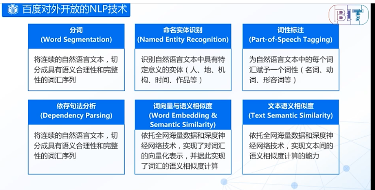

    使用相对路径插入图片。比如你把一个叫做1.png的图片和*.md文件放在一起，那么你就可以用这种方式插入图片：
    如果不想放在同一层级,那么就可以这样插入: 表示引用同层级一个叫做"foldername"的文件夹中的1.png图片,以此类推.

# 百度深度paddlepaddle学习

1. 自然语言处理中的 交叉歧义。  
分词工具：将连续的自然语言文本，切分成具有语义合理性和完整性的词汇序列。
2. 未登录词问题：从粒度上整合未登录实体词  
命名实体识别：识别自然语言文本中具有特定意义的实体（人、地、机构、时间、作品等）
3. 结构歧义问题——分析句法成分——》抽取句子中的核心成分  
词性标注工具：为自然语言文本中的每个词汇赋予一个词性
依存句法分析工具：自动分析句子中的句法成分（主语、谓语、宾语、状语、补语等成分）
4. 词汇语义相似度：向量化表示——相似度计算——向量化表示。词向量与语义相似度：对词汇进行向量化表示，并据此实现词汇的语义相似度计算
5. 文本语义相似度

>机器翻译：利用计算机，将一种自然语言（源语言）翻译为另外一种自然语言（目标语言）  自然语言：人类所用的语言，人类所独有的
~~~
机器翻译的定义包含 人工语言？C语言，JAVA语言吗？
~~~

拍照翻译：外国商品的使用、购买；国外旅游说明介绍；  

先中文——再语言多样，诗歌。聊天，商品翻译，翻译api做插件，机器翻译与语音识别结合，机器翻译与图像识别结合，翻译用来写诗

## 百度机器翻译 - 技术篇

1947年，开始机器翻译
1970年，基于规则的
1984，基于实例的机器翻译
**1991，统计机器翻译**
2014，神经网络机器翻译

2015，,2016，百度，谷歌 神经网络翻译系统

### 机器翻译训练数据

翻译系统:  
- 翻译模型：建立一个双语翻译模型
- 语言模型：衡量语言流畅度  之和

> NMT->基于神经网络的机器翻译,百度提出的一些方法  

> 百度机器翻译论文列表  

http://bit.baidu.com/Course/detail/id/54.html
百度翻译API如何调用

篇章分析：
形式上连接

内容标签、情感分析、自动摘要、文本问答

内容标签（聚合、用户画像、个性化推荐）
百度feed流：主题、话题、实体标签  

情感分析：舆情分析、消费决策

观点摘要：一句话推荐理由
情感分类、候选排序、评论拼接

自动摘要：新闻抽取摘要，
问答摘要技术
抽取式、压缩式、生成式
抽取式压缩式的流程：

语义对齐与DNN方法

